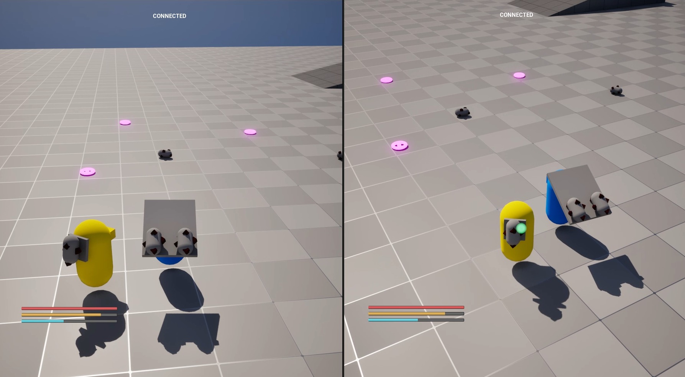

# Lost in Abyss — Unreal Engine Technical Portfolio



This repository is a public technical portfolio based on selected systems from my independent Unreal Engine project.

It is **not a full project source release**. The purpose of this repository is to show how I approach gameplay architecture, networking, replication, UI flow, subsystem design, and prototype-to-system iteration in Unreal Engine.

- **Role:** Independent Unreal Engine Developer
- **Development started:** February 20, 2026
- **Engine:** Unreal Engine 5.7
- **Project type:** Co-op gameplay prototype
- **Focus areas:** Gameplay systems, multiplayer interaction, replication, data-driven architecture, Common UI, custom subsystems

> Note: This repository focuses on the technical systems and engineering decisions, not on presenting a finished game loop.

---

## Best Code to Review First

| System | Why it matters | Start here |
|---|---|---|
| **Networked World Cursor & Drag/Drop** | Client-side prediction, server-authoritative validation, reconciliation, replicated clickable/draggable state | [System case](docs/systems/networked-world-cursor.md) |
| **Replicated Inventory** | Server-authoritative inventory operations, replicated slots, replicated UObject item instances through registered subobjects | [System case](docs/systems/replicated-inventory.md) |
| **World Markers Spatial Query** | Spatial grid, radius queries, weak references, movement-threshold updates, cleanup of invalid markers | [System case](docs/systems/world-markers-system.md) |
| **HQ Signal System** | Gameplay system iteration, obstacle-aware signal checks, subsystem-based source/receiver architecture, optimization history | [System case](docs/systems/hq-signal-system.md) |
| **Interaction Fragments** | Data-driven interaction options, action fragments, input-tag based execution path | [System case](docs/systems/interaction-fragments.md) |
| **Common UI Manager** | CommonUI layer stack, activatable widget routing, centralized local-player UI subsystem | [System case](docs/systems/common-ui-manager.md) |
| **Planet Gravity Prototype** | Chaos callback integration, gravity attractor components, custom character gravity direction | [System case](docs/systems/planet-gravity-system.md) |

---

## Repository Structure

```text
code/
  Selected C++ source excerpts grouped by gameplay system.

docs/
  systems/
    Portfolio case studies for each implemented system.
  devlog/
    Chronological development archive.
  portfolio/
    Maintenance notes and templates for adding new systems.

screenshots/
  Screenshots used by the system docs and devlog.
```

---

## How to Read This Repository

For a technical review, I recommend this order:

1. Start with [Networked World Cursor & Drag/Drop](docs/systems/networked-world-cursor.md).
2. Continue with [Replicated Inventory](docs/systems/replicated-inventory.md).
3. Check [World Markers Spatial Query](docs/systems/world-markers-system.md) for subsystem and query design.
4. Use the devlog only as historical context, not as the main portfolio entry point.

---

## Devlog Archive

- [June 2026](docs/devlog/2026-06.md)
- [May 2026](docs/devlog/2026-05.md)
- [April 2026](docs/devlog/2026-04.md)
- [March 2026](docs/devlog/2026-03.md)
- [February 2026](docs/devlog/2026-02.md)
