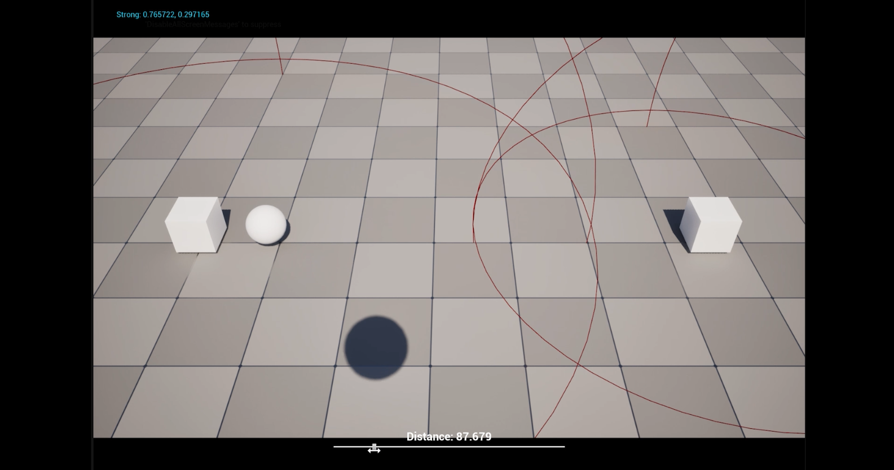

# Devlog — February 2026

## February 21, 2026 — HQ Signal System

**Tags:** Gameplay, Systems, Core Mechanic  
**Video:** https://youtu.be/g0srvQBo0Rc?si=LOVJi3EMkopikrvG  
**Related system:** [HQ Signal System](../systems/hq-signal-system.md)

### Summary

Implemented the first version of the HQ Signal System with signal sources and receivers.

The initial version calculates signal strength based on distance between the receiver and registered signal sources.

### What changed

- Added signal source and signal receiver components.
- Implemented distance-based signal strength.
- Added attenuation logic.

### Next steps from this stage

- Add delay before signal loss.
- Stress test with 500+ signal sources.
- Test a tree-based lookup approach for selecting the appropriate source.
- Add signal extension behavior for receivers.

