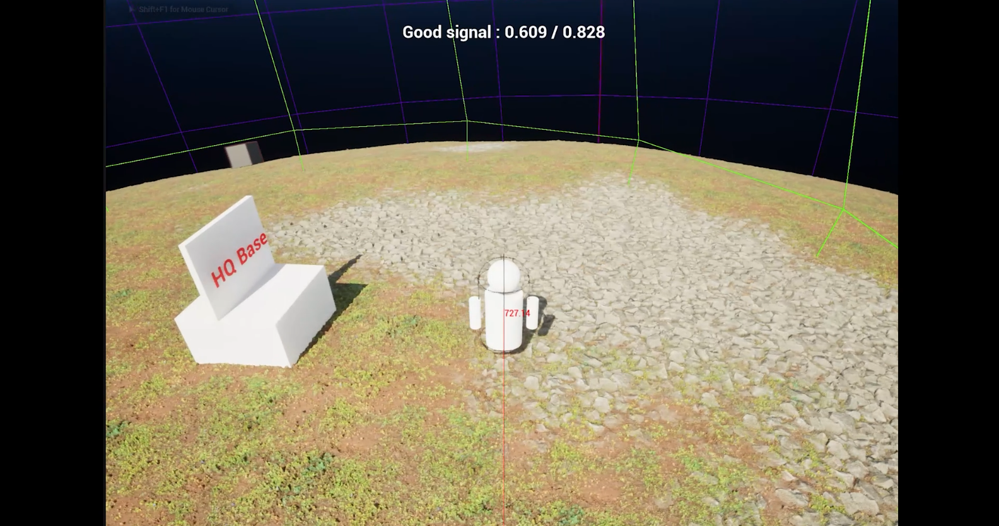
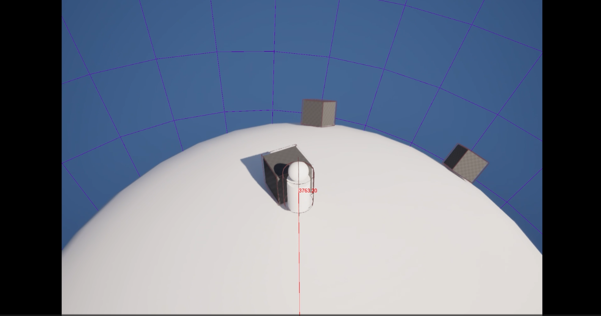

# Devlog — March 2026

## March 16, 2026 — Voxel Planet Integration

**Tags:** Voxel, World Generation  
**Video:** https://youtu.be/pEuiPZgKgmw?si=xW_Hs3763l_jcww2  
**Related system:** [Planet Gravity Prototype](../systems/planet-gravity-system.md)

### Summary

Integrated Voxel Plugin 2.0 and created the first unified planet prototype.

### Next steps from this stage

- Implement a terraforming tool.
- Test terrain interaction pipeline.
- Evaluate performance.

---

## March 15, 2026 — Character Gravity Movement

**Tags:** Physics, Movement, Gravity  
**Video:** https://youtu.be/xbRxen8aRhs?si=GcUwqQ1tPIV_m3VL  
**Related system:** [Planet Gravity Prototype](../systems/planet-gravity-system.md)

### Summary

Implemented character movement aligned with dynamic gravity sources.

### Next steps from this stage

- Add smooth interpolation between gravity sources.
- Add velocity-based rotation logic.

---

## March 13, 2026 — Planetary Gravity System with Chaos Physics

**Tags:** Physics, Chaos, Gravity, Core System  
**Video:** https://youtu.be/8Zs5AkZgMYs?si=TYFQ58QVBwfV2dXV  
**Related system:** [Planet Gravity Prototype](../systems/planet-gravity-system.md)

### Summary

Implemented a spherical gravity prototype using Chaos Physics callback concepts.

### Next steps from this stage

- Clamp velocity near the gravity origin.
- Implement gravity falloff.
- Stress test with multiple attractors.

