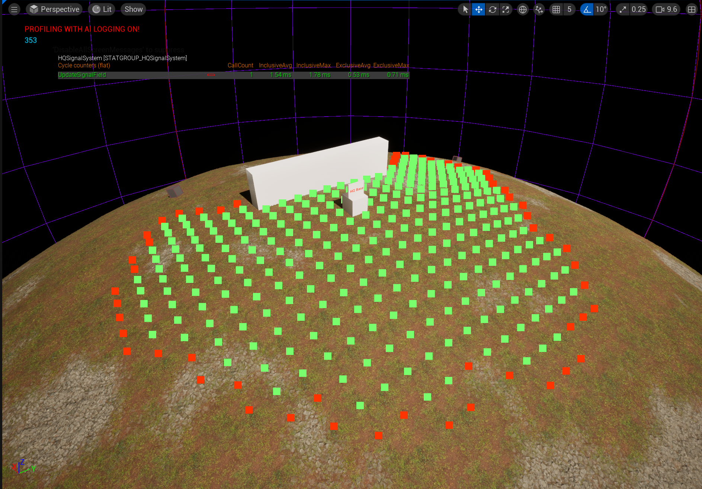
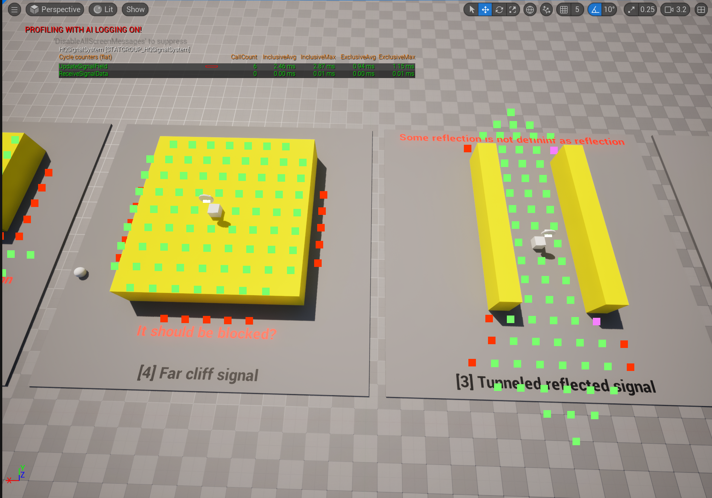
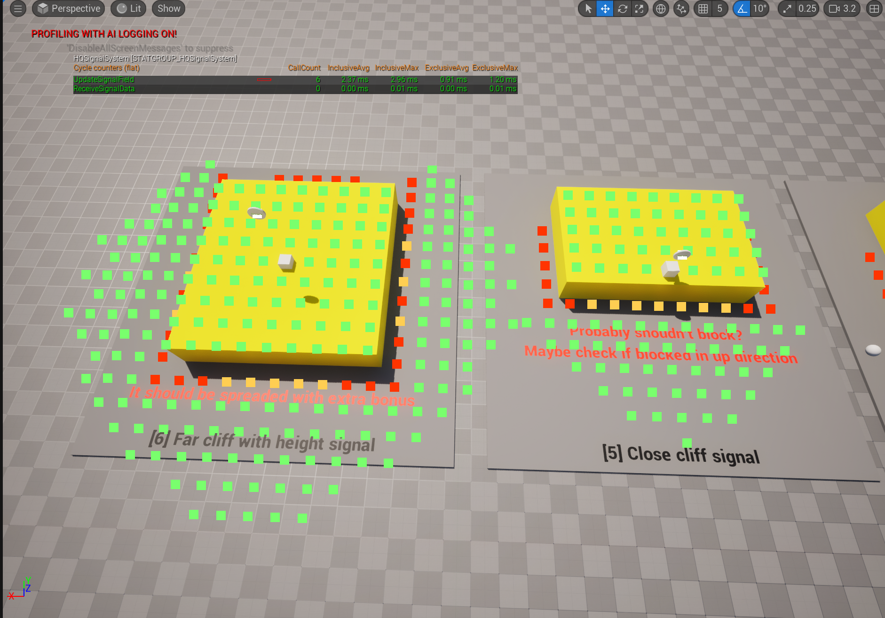

# Devlog — April 2026

## April 14, 2026 — Signal Field Strength Redesign

**Video:** https://youtu.be/RXv0JBYXTt8  
**Video:** https://youtu.be/-NlApun-mIs  
**Related system:** [HQ Signal System](../systems/hq-signal-system.md)

### Summary

Created the first prototype of a new signal field spreading model.

The idea was to make signal coverage react to obstacles instead of spreading only through a simple radius. The prototype converted receiver world position into the signal source local XY space and evaluated signal strength from that field.

The first optimization pass reduced the prototype cost from approximately `~60ms` to `~16ms`.

### Next steps from this stage

- Continue optimizing the algorithm.
- Optimize signal-strength lookup.
- Increase signal spread based on source height relative to the ground.
- Add an in-game visual grid for signal boundaries.

---

## April 16, 2026 — Signal Field Algorithm Update

**Related system:** [HQ Signal System](../systems/hq-signal-system.md)

### Summary

Optimized the previous solution from approximately `~16ms` to `~2ms`.

After optimization, the code was refactored and the signal spreading problem in the air was fixed. A new cliffed-cell type was added so antenna placement on higher ground could improve signal coverage.

The goal was to support gameplay where players place or upgrade antennas to increase signal coverage.

### Next steps from this stage

- Continue optimizing at lower priority.
- Refactor the algorithm for future signal source upgrades.
- Add an in-game visual grid for signal boundaries.

