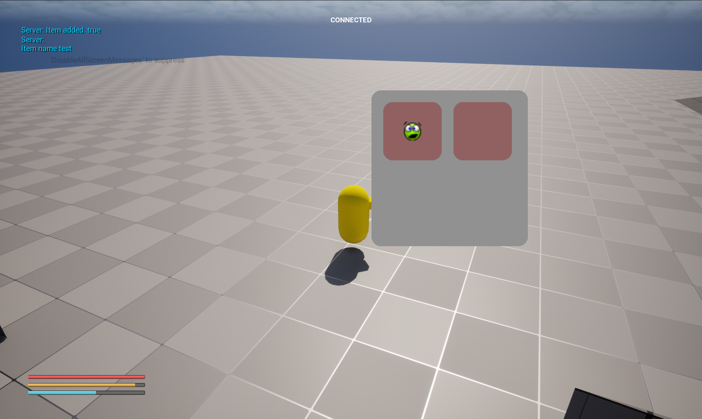
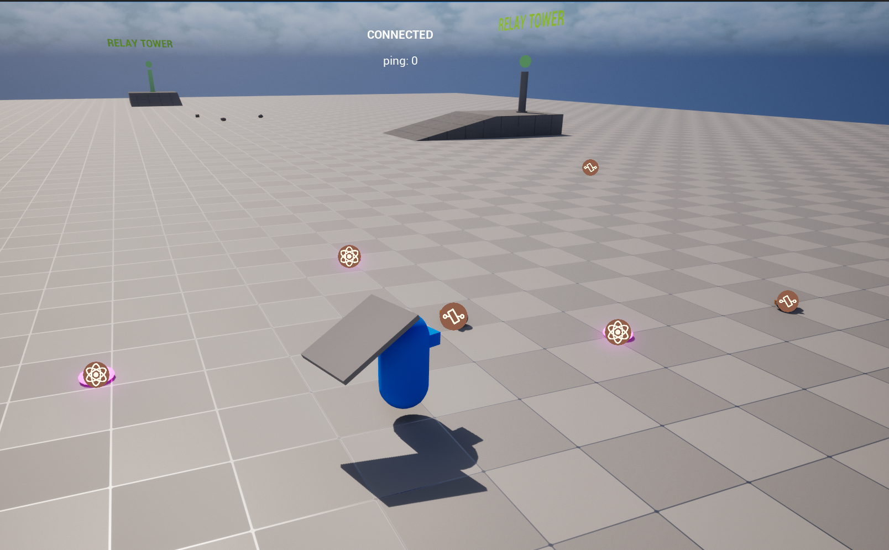

# Devlog — May 2026

## May 9, 2026 — Signal System Redesign

**Video:** https://youtu.be/_Sbjz6whLI4  
**Related system:** [HQ Signal System](../systems/hq-signal-system.md)

### Summary

After optimization and gameplay evaluation, the complex HQ Signal System was simplified.

The previous version was technically interesting, but it did not create the desired gameplay experience. The system returned to a simpler source/receiver model, with obstacle checks and signal reduction based on obstacle depth.

This iteration also added GAS to the project and defined base attributes.

### Next steps from this stage

- Define the gameplay around the signal system more clearly.
- Create temporary and permanent signal relays.
- Add penalties for being outside signal coverage, including Energy and HUD support.

---

## May 14, 2026 — Inventory and UI Manager

**Video:** https://youtu.be/8myK1yx84zw  
**Related systems:** [Replicated Inventory](../systems/replicated-inventory.md), [Common UI Manager](../systems/common-ui-manager.md)

### Summary

Implemented the first inventory system using a data-driven approach: item definitions are data assets, and runtime items are represented by item instances.

After completing the base inventory functionality, the design direction changed. The storage-style inventory is useful for large storages such as a player base, but it does not create the desired physical gameplay feeling.

The next direction became a physical inventory, where items can be attached to robots or placed into physical containers.

The UI manager was also started using CommonUI. MVVM was considered, but postponed because it was not necessary for the current vertical slice.

### Next steps from this stage

- Define items such as Ferrite and Ancient Core.
- Implement the first physical inventory prototype.

---

## May 20, 2026 — World Cursor Interaction

**Video:** https://youtu.be/lsPxvO_kRjA  
**Related system:** [Networked World Cursor & Drag/Drop](../systems/networked-world-cursor.md)

### Summary

Implemented the world cursor component for clickable world objects.

The enhanced version adds drag/drop detection and draggable components for actors that need this behavior.

Both clickable and draggable components support client and server logic with reconciliation. The cursor performs local prediction, while the clicked/draggable components decide how to apply and correct their state.

### Known issue from this stage

The current draggable mover conflicts with replicated actor movement and can create visible lag on the client. This was moved to the backlog so the physical inventory prototype could continue.

### Next steps from this stage

- Build the physical inventory prototype on top of drag/drop interaction.

---

## May 21, 2026 — Physical Inventory

**Video:** https://youtu.be/BK0o5DeKHO8  
**Related system:** [Replicated Inventory](../systems/replicated-inventory.md)

### Summary

Tested different approaches for physical inventory.

The current temporary solution uses sockets for items. The goal was to show a gameplay difference between Scout and Hauler: Scout can bring one item, while Hauler can bring multiple items.

Several critical bugs were also found and fixed.

### Next steps from this stage

- Design the building structure mechanic.
- Implement building structures such as relay towers.

---

## May 24, 2026 — Building System and World Markers

**Video:** https://youtu.be/GP1ENfYtaH8  
**Video:** https://youtu.be/bbm6qQ9YUD0  
**Related system:** [World Markers Spatial Query](../systems/world-markers-system.md)

### Summary

Implemented the first version of a simple building mechanic. The player can complete pre-placed structures by bringing resources to them.

This may later become a more traditional building system where players place structures directly, but the current version is enough to test the gameplay loop.

Also implemented the world marker system, which shows interesting objects within a radius. Multithreaded calculation for nearest objects was considered for future testing, but not implemented at this stage.

### Next steps from this stage

- Design resource gathering.
- Implement resource gathering.
- Add an orbital station mockup.
- Design the level prototype.

