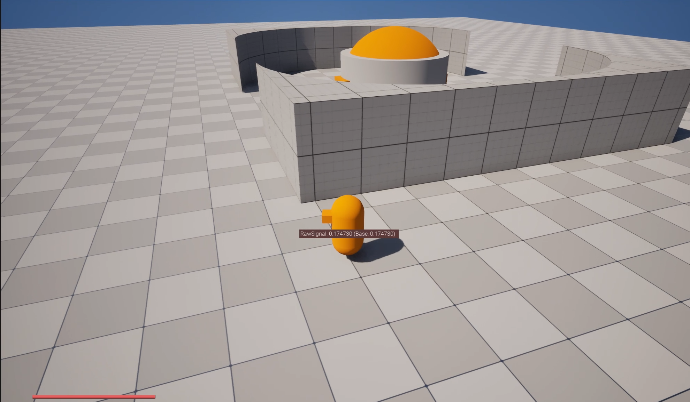
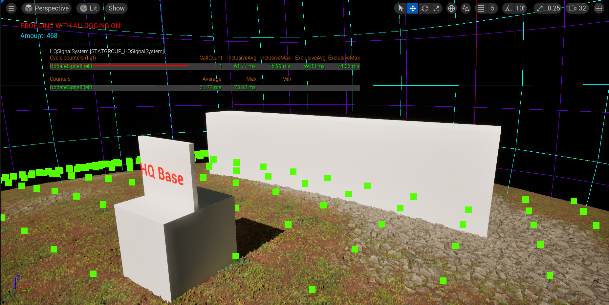
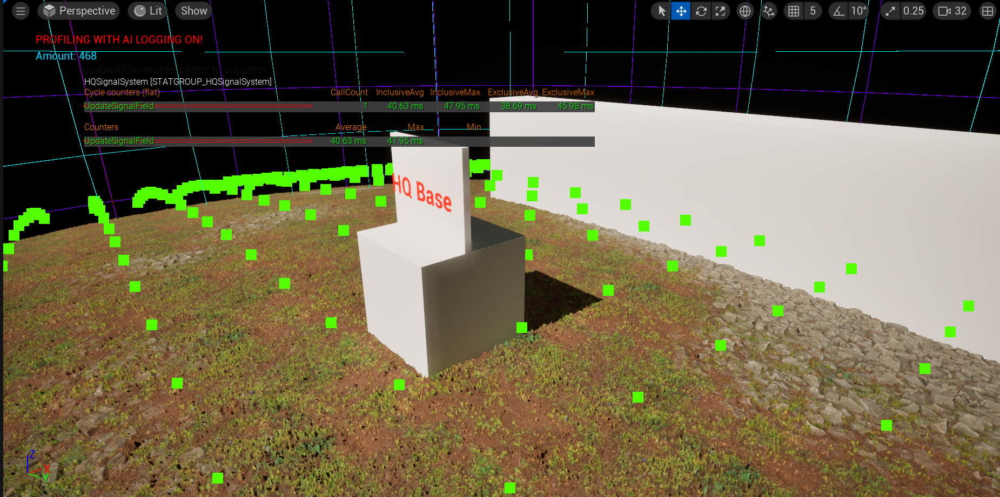
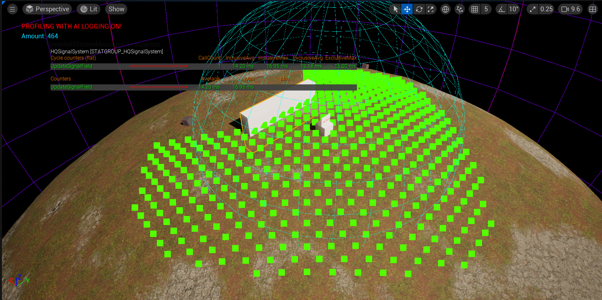
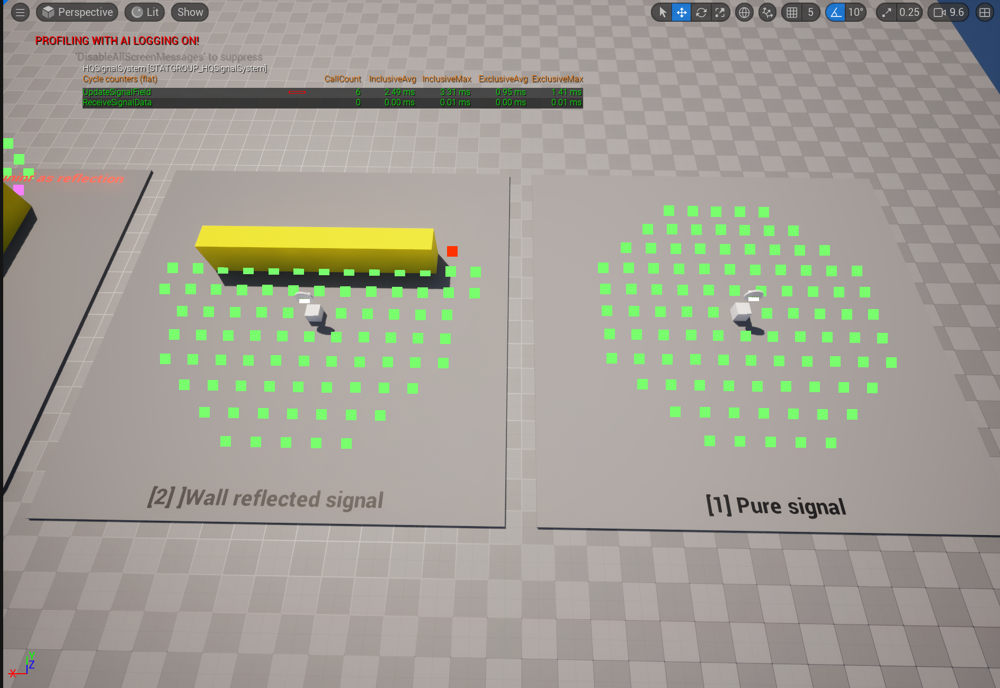

# HQ Signal System

A gameplay signal-coverage system based on signal sources and receivers.



## Status

- **Current status:** Iterated prototype.
- **Main purpose:** Restrict robot/control gameplay by base signal coverage.
- **Best files to review first:**
  - [HQSignalSystem.cpp](../../code/HQSignalSystem/HQSignalSystem.cpp)
  - [HQSignalReceiverComponent.cpp](../../code/HQSignalSystem/HQSignalReceiverComponent.cpp)
  - [HQSignalSourceComponent.cpp](../../code/HQSignalSystem/HQSignalSourceComponent.cpp)

## Problem

The original Lost Signal concept required the player to operate within signal coverage from the base/HQ.

Robots or vehicles should receive a signal value based on their distance to sources and whether obstacles block or weaken the signal.

## Constraints

- Signal sources must register/unregister dynamically.
- Receivers need to query signal strength from the world.
- Obstacles can reduce signal strength.
- The system must be cheap enough for prototype gameplay.
- The game design changed over time, so the system went through multiple iterations.

## Architecture

```text
Signal Source Actor
└── UHQSignalSourceComponent
    ├── reads radius and penetration from data
    └── registers in UHQSignalSystem

Signal Receiver Actor
└── UHQSignalReceiverComponent
    ├── ticks while active
    └── broadcasts OnSignalUpdated(FHQSignalData)

UHQSignalSystem
├── stores signal sources
├── evaluates strongest signal for a receiver
├── applies distance falloff
└── applies obstacle penetration reduction
```

## Implementation Notes

The selected source shows the simplified signal model:

- iterate registered signal sources;
- ignore sources outside radius using squared distance;
- compute strength from normalized distance;
- trace from source to receiver;
- if an obstacle blocks the trace, perform a reverse trace;
- estimate obstacle depth;
- reduce signal strength based on source penetration;
- return strongest signal value and signal strength enum.

The system also includes a console variable for debug signal display.

## Iteration and Optimization History

The devlog shows multiple signal-system iterations:

- initial distance-based signal strength;
- a more complex signal field/spreading prototype;
- optimization from approximately `~60ms` to `~16ms`;
- further optimization from approximately `~16ms` to `~2ms`;
- later simplification after gameplay testing showed the complex version did not support the desired player experience.

This is an important portfolio point: the system was not just implemented once; it was tested, optimized, and then simplified based on gameplay value.






## Trade-offs

The complex signal field was technically more interesting, but the devlog states that it did not create the right gameplay experience. The system was simplified back into a more direct source/receiver model.

That decision is useful for senior review because it shows an engineering trade-off based on gameplay value, not only technical complexity.

## Known Limitations

- The selected source uses tick-based receiver updates.
- The trace channel is still marked as a TODO for configuration.
- Signal change detection is marked as a TODO to avoid broadcasting unchanged data.
- The current simplified implementation is not the final design.

## Next Steps

- Move trace/channel settings into configurable data.
- Avoid broadcasting unchanged signal values.
- Add update-rate control for receivers.
- Add relay sources or environment modifiers if the signal mechanic remains part of the project.

