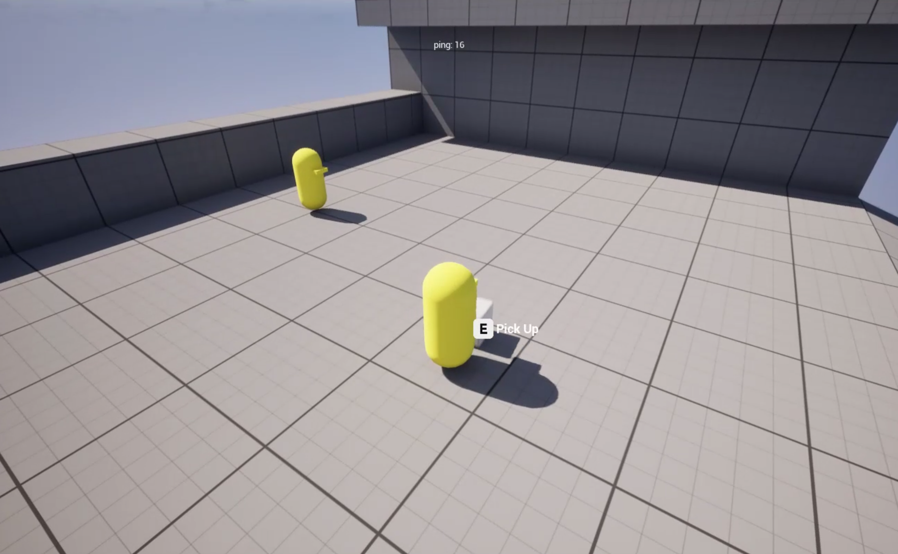

# Interaction Fragments

A component-based interaction prototype where actors expose available actions through interaction fragments.



## Status

- **Current status:** Early prototype / architecture direction.
- **Main purpose:** Make interaction actions composable instead of hardcoding every action into actor classes.
- **Best files to review first:**
  - [InteractionComponent.h](../../code/Interaction/InteractionComponent.h)
  - [InteractableComponent.h](../../code/Interaction/InteractableComponent.h)
  - [InteractionFragment.h](../../code/Interaction/InteractionFragment.h)

## Problem

After the project started shifting from Lost Signal toward Lost in Abyss, the interaction model needed to support a new gameplay loop.

The goal was to avoid putting every possible action directly into actor classes. Objects should be able to expose context-dependent options such as pickup, use, activate, consume, or other future actions.

## Constraints

- Interactions need to support multiple options per target.
- Options should be selected through input tags.
- The system should be friendly to UI hints for keyboard/gamepad.
- The interaction target should not become a large class with many hardcoded action branches.
- The implementation is still a prototype.

## Architecture

```text
Interactor Actor
└── UInteractionComponent
    ├── current target
    ├── current options
    ├── option lookup by input tag
    └── option execution

Interactable Actor
└── UInteractableComponent
    └── UInteractableDefinition
        └── UInteractionFragment[]
            ├── CanBeExecuted(Context)
            └── TryExecute(Context)
```

## Implementation Notes

- `UInteractionComponent` stores the current target and current options.
- `FInteractionTargetOptions` groups a target actor with its available options.
- `TryExecuteOptionWithInput` allows an input tag to resolve into an interaction option.
- `UInteractionFragment` owns display text, input tag, priority, and execution checks.
- `GetOption()` builds a lightweight `FInteractionOption` from fragment data.

## Trade-offs

The system is currently represented by headers and architecture rather than a complete production implementation.

It is still useful as a portfolio case only if presented as an architecture direction, not as a fully finished interaction framework.

## Known Limitations

- Full implementation source is not included in the selected code.
- Networking/authority rules for interaction execution are not shown here.
- Fragment ownership and definition data are not fully documented in code excerpts.
- Gameplay examples for concrete fragments are not included.

## Next Steps

- Add concrete fragment examples once they exist.
- Document which side executes each interaction type: interactor, target, server, or local UI.
- Add explicit authority rules before using this for networked gameplay.
- Connect interaction options to UI hint rendering in a dedicated case study if that becomes important.

