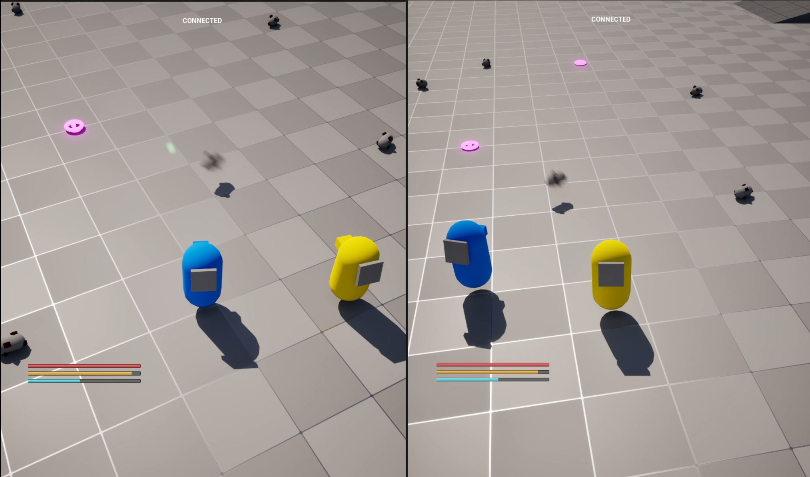

# Networked World Cursor & Drag/Drop

A networked world interaction system for clickable and draggable actors.



## Status

- **Current status:** Prototype implementation with known movement/replication limitations.
- **Main purpose:** Allow local players to click, hover, drag, and drop world actors while keeping server authority.
- **Best files to review first:**
  - [WorldCursorComponent.cpp](../../code/WorldCursorComponent/WorldCursorComponent.cpp)
  - [WorldEnhancedCursorComponent.cpp](../../code/WorldCursorComponent/WorldEnhancedCursorComponent.cpp)
  - [WorldClickableComponent.cpp](../../code/WorldCursorComponent/WorldClickableComponent.cpp)
  - [WorldDraggableComponent.cpp](../../code/WorldCursorComponent/WorldDraggableComponent.cpp)

## Problem

The physical inventory prototype required direct world interaction with objects.

The player needed immediate local feedback when clicking and dragging, but the server still had to own the authoritative result. A simple server-only interaction flow would be too delayed for responsive drag-and-drop gameplay.

## Constraints

- The interaction must feel responsive on the local client.
- The server must validate the selected actor and final state.
- Click, release, hover, drag, dragging, and drop need separate handling.
- The same interaction layer should work with different actor implementations through interfaces/components.
- The system is still part of a prototype, so it prioritizes iteration speed over final polish.

## Architecture

```text
PlayerController
└── UWorldCursorComponent
    ├── traces from the player camera / cursor
    ├── handles click, release, hover, unhover
    ├── sends server RPCs
    └── reconciles predicted local state

UWorldEnhancedCursorComponent
└── extends cursor behavior with drag/drop
    ├── local drag prediction
    ├── throttled server drag updates
    └── drag/drop reconciliation

Interactable Actor
├── IWorldCursorInterface
│   └── UWorldClickableComponent
└── IWorldDraggableInterface
    └── UWorldDraggableComponent
```

## Networking / Authority Model

The system uses a client-predicted / server-authoritative model.

### Client-side prediction

On the owning client:

- the cursor traces locally;
- click/drag feedback can be applied immediately;
- predicted state is stored locally;
- each action receives an incrementing `ActionId`.

### Server authority

On the server:

- the server performs its own trace using the provided trace start and direction;
- the server validates the target actor and component;
- authoritative click/drag state is applied;
- the server sends reconciliation data back to the client.

### Reconciliation

The client compares the predicted actor/component with the server-approved state.

If prediction and authority disagree:

- the predicted local state is rolled back;
- the server-approved state is applied;
- processed action ids prevent old server responses from applying twice.

Relevant implementation points:

- `DoClickPrediction`
- `Server_CursorClick_Implementation`
- `Client_ReconcileCursorClick_Implementation`
- `RollbackLocalClick`
- `Server_UpdateDraggingLocation_Implementation`
- `Client_ReconcileDragging_Implementation`

## Implementation Notes

- `UWorldCursorComponent` owns basic click/release/hover behavior.
- `UWorldEnhancedCursorComponent` adds drag/drop behavior on top of the base cursor.
- `UWorldClickableComponent` replicates authoritative clicked state.
- `UWorldDraggableComponent` replicates authoritative drag state and resolves prediction correction.
- Interfaces are used to get the correct clickable/draggable component from an actor instead of hard-binding the cursor to a specific actor class.
- Dragging updates are throttled through `DragUpdateRate` and `DragLocationTolerance`.

## Trade-offs

The current implementation is focused on proving the networking flow rather than final object movement quality.

The devlog explicitly notes that the current draggable mover can conflict with replicated actor movement and create visible client-side lag. That issue was left in the backlog while the project moved forward to the physical inventory prototype.

## Known Limitations

- Dragged actor movement still needs a cleaner solution against replicated movement.
- Drag update validation is marked as a TODO.
- Hover handling is local-only.
- The system should eventually separate cursor input, target selection, and object movement policy more clearly.

## Next Steps

- Replace the prototype drag mover with a movement path that does not fight replicated actor movement.
- Add stricter validation for drag update locations.
- Move trace/channel settings into data/configuration.
- Add debug visualization for prediction vs authority mismatch.

