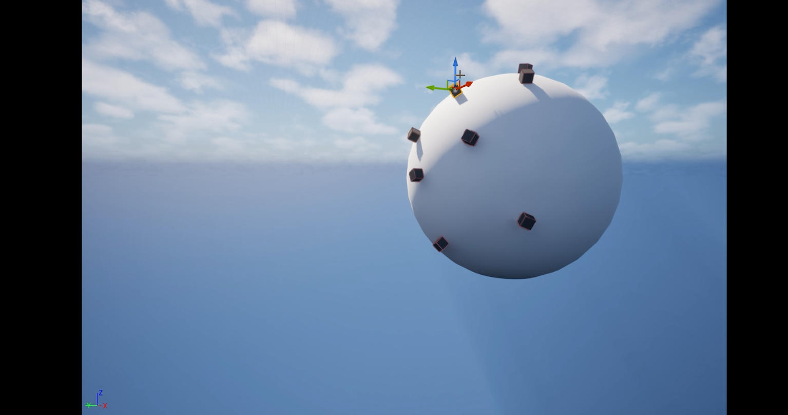

# Planet Gravity Prototype

A custom gravity prototype for spherical worlds using gravity attractors and Chaos simulation callbacks.



## Status

- **Current status:** Prototype / exploratory system.
- **Main purpose:** Test character and physics behavior around spherical gravity sources.
- **Best files to review first:**
  - [PlanetGravitySubsystem.cpp](../../code/PlanetGravitySystem/PlanetGravitySubsystem.cpp)
  - [PlanetGravityAttractorComponent.cpp](../../code/PlanetGravitySystem/PlanetGravityAttractorComponent.cpp)
  - [PlanetGravityCharacterMovement.cpp](../../code/PlanetGravitySystem/PlanetGravityCharacterMovement.cpp)

## Problem

The early project direction included planets and spherical-world traversal. The prototype needed gravity that could pull physics bodies and characters toward attractor components rather than relying on default world gravity.

## Constraints

- Gravity sources can exist as components in the world.
- Gravity data needs to be passed before physics.
- Character orientation needs to align to the current gravity direction.
- The implementation is exploratory and based on Chaos callback concepts.

## Architecture

```text
Planet / Gravity Actor
└── UPlanetGravityAttractorComponent
    ├── ticks in PrePhysics
    ├── builds gravity attractor data
    └── sends data to UPlanetGravitySubsystem

UPlanetGravitySubsystem
├── stores attractor components
├── registers Chaos simulation callback
└── sends gravity data into async callback input

Character
└── UPlanetGravityCharacterMovement
    ├── sums acceleration from applicable attractors
    ├── applies force
    └── sets gravity direction
```

## Implementation Notes

- Attractor components register/unregister with the subsystem.
- Attractors tick in `TG_PrePhysics` to prepare gravity input before physics simulation.
- The subsystem creates and registers a simulation callback object through the Chaos solver.
- Character movement computes additional acceleration from active attractors and calls `SetGravityDirection`.

## Trade-offs

This system is a prototype and should be treated as exploratory. It is useful for showing custom physics/movement experimentation, but it is less directly relevant to Senior Gameplay Multiplayer review than the world cursor, inventory, and marker systems.

## Known Limitations

- Debug drawing/logging is still present in the selected source.
- Smooth interpolation between gravity sources is listed in the devlog as future work.
- The system is not presented as production-ready.
- Full async callback implementation is not included in the selected source excerpts.

## Next Steps

- Remove debug drawing from runtime paths.
- Add smoothing when switching gravity directions.
- Add tests with multiple attractors.
- Document the async callback implementation if it is added to the public code excerpts.

